# 2.CQL基本语法

## 1.CQL命令条款

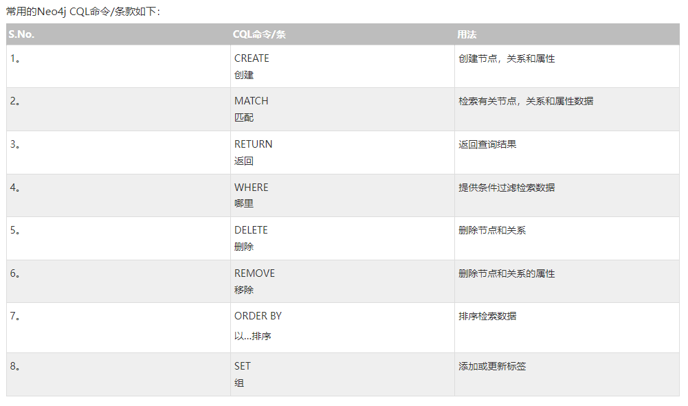

## 2.CQL常用函数

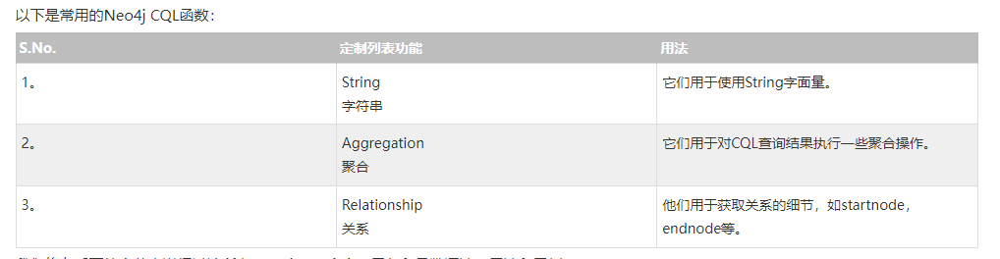

## 3.CQL 数据类型

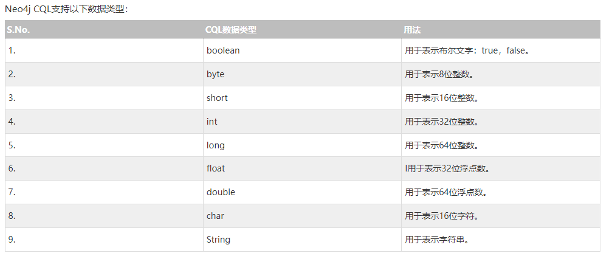

## 4.CQL基础操作

### 4.1 CREAT命令（TODO）（增）

Neo4j使用CQL“CREATE”命令

* 创建没有属性的节点
* 创建有属性的节点
* 节点之间创建关系

#### 4.1.1 创建一个没有属性的节点

​`CREATE (<node-name>:label-name)`​

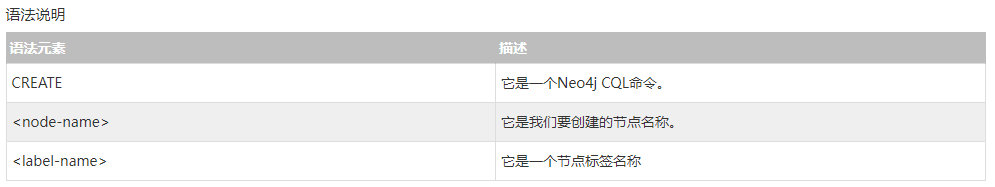

	1、Neo4j数据库服务器使用此<node-name>将此节点详细信息存储在Database.As中作为Neo4j DBA或Developer，我们不能使用它来访问节点详细信息。

	2、Neo4j数据库服务器创建一个<label-name>作为内部节点名称的别名。作为Neo4j DBA或Developer，我们应该使用此标签名称来访问节点详细信息。

#### 4.1.2 创建一个具有属性的节点

```undefined
CREATE (
   <node-name>:<label-name>
   { 
      <Property1-name>:<Property1-Value>
      ........
      <Propertyn-name>:<Propertyn-Value>
   }
)
```

#### 4.1.3 创建节点之间的关系

```undefined
MATCH (<node1-label-name>:<node1-name>),(<node2-label-name>:<node2-name>) 
WHERE <condition>
CREATE (<node1-label-name>)-[<relationship-label-name>:<relationship-name>
       {<relationship-properties>}]->(<node2-label-name>) 
```

举个例子：

```undefined
MATCH (cust:Customer),(cc:CreditCard) 
WHERE cust.id = "1001" AND cc.id= "5001" 
CREATE (cust)-[r:DO_SHOPPING_WITH{shopdate:"12/12/2014",price:55000}]->(cc) 
RETURN r
```

#### 4.1.4 为节点创建单个标签或多个标签

* 为节点创建单个标签
* 为节点创建多个标签
* 为关系创建单个标签

**4.1.4.1 创建单个标签**

​`CREATE (<node-name>:label-name)`​

**4.1.4.2 创建多个标签**

​`CREATE (<node-name>:label-name1:label-name2.....:label-namen)`​

**4.1.4.3 为关系创建标签**

```undefined
CREATE (<node1-name>:<label1-name>)-
	[<relationship-name>:<relationship-label-name>]
	->(<node2-name>:<label2-name>)
```

### 4.2 MATCH命令（查）

CQL MATCH 命令用于

* 从数据库获取有关节点和属性的数据
* 从数据库获取有关节点，关系和属性的数据、

```undefined
MATCH 
(
   <node-name>:<label-name>
)
```

如果单独使用上述代码你观察到错误消息，它告诉我们，MATCH 经常需要与其他的语句配合才可以使用.

如：match (n) return n

### 4.3 RETURN命令

```
RETURN 
   <node-name>.<property1-name>,
   ........
   <node-name>.<propertyn-name>
```

​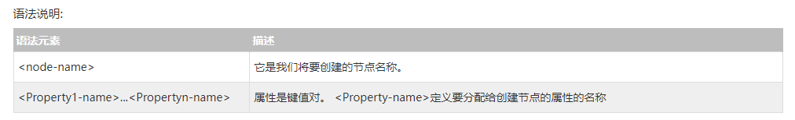​

如果您发现该错误消息，它告诉我们，我们不能单独使用RETURN子句。我们应该使用MATCH或CREATE命令。

### 4.4 MATH&RETURN匹配和返回（TODO）

Neo4j使用CQL MATCH + RETURN命令 

* 检索节点/关系的某些属性
* 检索节点/关系的实例
* 检索所有节点/关系实例

#### 4.4.1 检索节点/关系的某些属性

**检索节点的某些属性**

```undefined
MATCH (dept: Dept)
RETURN dept.deptno,dept.dname
```

**检查关系的某些属性**

> MATCH (p:Person)<-[m:`主演`​]-(l:Moive) return m.properties

‍

#### 4.4.2 检索节点/关系实例

**检索节点实体**

```undefined
MATCH (dept: Dept)
RETURN dept
```

**检索关系实例**

> MATCH (p:Person)<-[m:`主演`​]-(l:Moive) return m

#### 4.4.3 检索所有节点/关系实例

检索两个节点之间所有关系实例

​`MATCH (cc:CreditCard)-[p]-(c:Customer) RETURN p ​`​

检索含有某个关系的所有进入关系的节点

​`MATCH (p:Person)<-[m:`主演`]-(l) return l ​`​

‍

### 4.5 关系基础（TODO)

在Neo4j中，两个节点之间的关系是有方向性的。 它们是**单向或双向**的。

由于Neo4j遵循属性图数据模型，它应该只支持方向关系。 如果我们尝试创建一个没有任何方向的关系，那么Neo4j DB服务器应该抛出一个错误。

### 4.6 WHERE子句

**简单的where语法子句**

​`WHERE <condition>`​

**复杂的where子句**

​`WHERE <condition> boolean-operator condition`​

**condition语法**

​`<property-name> comparison-operator ​`​

**布尔运算符**

​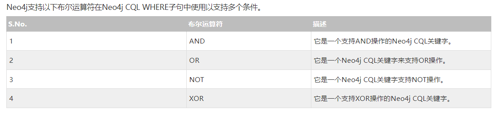​

**比较运算符**

​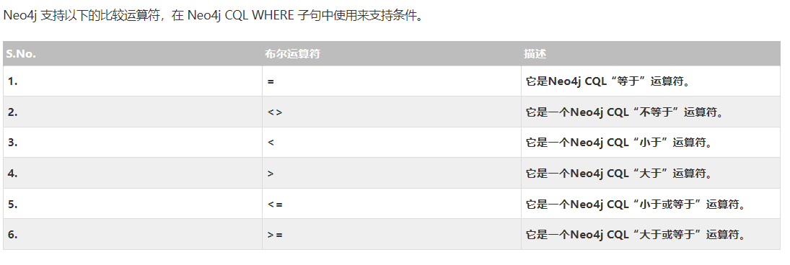​

‍

### 4.7 Delete删除(删）

* 删除节点。
* 删除节点及相关节点和关系。

#### 4.7.1 删除节点

​`MATCH (e: Employee) DELETE e`​

#### 4.7.2 删除关系

```undefined
MATCH (cc: CreditCard)-[rel]-(c:Customer) 
DELETE cc,c,rel
```

‍

### 4.8 REMOVE删除（删）

有时基于我们的客户端要求，我们需要向现有节点或关系添加或删除属性。

我们使用Neo4j CQL SET子句向现有节点或关系添加新属性。

我们使用Neo4j CQL REMOVE子句来删除节点或关系的现有属性。

**Neo4j CQL REMOVE命令用于**

* 删除节点或关系的标签
* 删除节点或关系的属性

Neo4j CQL DELETE和REMOVE命令之间的**主要区别** -

* DELETE操作用于删除节点和关联关系。
* REMOVE操作用于删除标签和属性。

Neo4j CQL DELETE和REMOVE命令之间的相似性 -

* 这两个命令不应单独使用。
* 两个命令都应该与MATCH命令一起使用。

**REMOVE属性子句语法**

​`REMOVE <property-name-list>`​

**&lt;property-name-list&gt; &lt;属性名称列表&gt;语法**

```undefined
<node-name>.<property1-name>,
<node-name>.<property2-name>, 
.... 
<node-name>.<propertyn-name> 
```

#### **4.8.1 删除节点属性**

```undefined
MATCH (dc:DebitCard) 
REMOVE dc.cvv
RETURN dc
```

#### **4.8.2 删除节点标签**

```undefined
MATCH (m:Movie) 
REMOVE m:Picture
```

### 4.9 SET子句（改）

* 向现有节点或关系添加新属性
* 添加或更新属性值

**SET子句语法**

​`SET  <property-name-list>`​

**&lt;属性名称列表&gt;语法：**

```undefined
<node-label-name>.<property1-name>,
<node-label-name>.<property2-name>, 
.... 
<node-label-name>.<propertyn-name> 
```

#### 4.9.1 向现有节点添加新属性

MATCH (book:Book) SET book.title = 'superstar' RETURN book

### 4.10 ORDER BY排序

**ORDER BY子句语法**

​`ORDER BY  <property-name-list>  [DESC]	`​

**&lt;property-name-list&gt;语法：**

```undefined
<node-label-name>.<property1-name>,
<node-label-name>.<property2-name>, 
.... 
<node-label-name>.<propertyn-name> 
```

#### 4.10.1 按照节点属性排序

```undefined
MATCH (emp:Employee)
RETURN emp.empid,emp.name,emp.salary,emp.deptno
ORDER BY emp.name DESC
```

### 4.11 UNION合并

与SQL一样，Neo4j CQL有两个子句，将两个不同的结果合并成一组结果

* UNION
* UNION ALL

#### 4.11.1 UNION

**UNION子句语法（返回两组结果的并集，两条重复的只返回一条）**

```undefined
<MATCH Command1>
   UNION
<MATCH Command2>
```

**错误的使用方法：**

```undefined
MATCH (cc:CreditCard) RETURN cc.id,cc.number
UNION
MATCH (dc:DebitCard) RETURN dc.id,dc.number
```

这里的两个标签具有相同的属性名：身份证和号码，但他们有不同的节点名称前缀。会报错（这两个查询应具有相同的列名）

**正确的使用方法：**

```undefined
MATCH (cc:CreditCard)
RETURN cc.id as id,cc.number as number,cc.name as name,
   cc.valid_from as valid_from,cc.valid_to as valid_to
UNION
MATCH (dc:DebitCard)
RETURN dc.id as id,dc.number as number,dc.name as name,
   dc.valid_from as valid_from,dc.valid_to as valid_to
```

重新命名属性名称，使名称相同。

#### 4.11.2 UNION ALL

**UNION ALL子句语法**

```undefined
<MATCH Command1>
UNION ALL
<MATCH Command2>
```

例子：

```undefined
MATCH (cc:CreditCard)
RETURN cc.id as id,cc.number as number,cc.name as name,
   cc.valid_from as valid_from,cc.valid_to as valid_to
UNION ALL
MATCH (dc:DebitCard)
RETURN dc.id as id,dc.number as number,dc.name as name,
   dc.valid_from as valid_from,dc.valid_to as valid_to
```

**在这里，我们可以观察到这个命令重复行返回多次，因为与UNION ALL子句不过滤它们重复行。如果我们使用UNION子句，它将返回一次。**

### 4.12 LIMIT和SKIP

Neo4j CQL提供“**LIMIT**”子句来过滤或限制查询返回的行数。 它修剪CQL查询**结果集底部**的结果。

如果我们要修整CQL查询**结果集顶部**的结果，那么我们应该使用**CQL SKIP**子句(即跳过前N个实体）。 

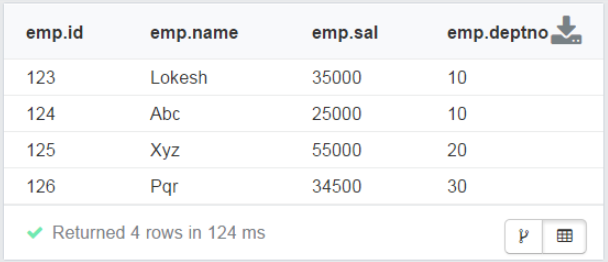

```undefined
MATCH (emp:Employee) 
RETURN emp
LIMIT 2
```

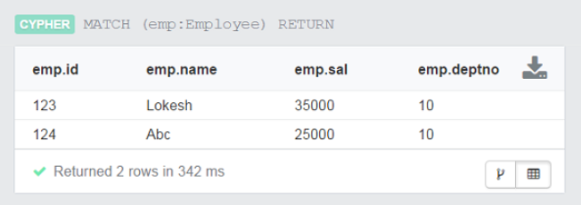

```undefined
MATCH (emp:Employee) 
RETURN emp
SKIP 2
```

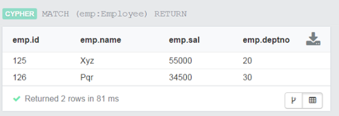

### 4.12 合并（MERGE)

MERGE命令是CREATE命令和MATCH命令的组合。

```
MERGE = CREATE + MATCH
```

Neo4j CQL MERGE命令在图中搜索给定模式，**如果存在，则返回结果**

**如果它不存在于图中，则它创建新的节点/关系并返回结果**。

CREATE (gp1:GoogleProfile1 {Id: 201401, Name:"Apple"})

CREATE (gp1:GoogleProfile1 {Id: 201401, Name:"Apple"})

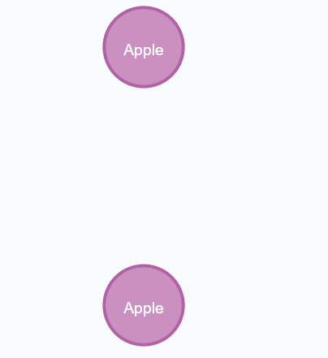

CREATE (gp1:GoogleProfile1 {Id: 201401, Name:"Apple"})

MERGE (gp1:GoogleProfile1 {Id: 201401, Name:"Apple"})

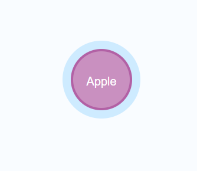

**更进一步**

MERGE (gp1:GoogleProfile1 {Id: 201401, Name:"Apple"}) 如何该标签存在这个实体，则相当于一个match操作

​`MERGE (n:Person {name: '小明'})
ON CREATE SET
	n.created = timestamp(),
	n.age =15
ON MATCH SET
  n.counter = coalesce(n.counter, 0) + 1,
  n.accessTime = timestamp();`​

	如果能够match到的话，就执行第二条，如果不能match到的话就执行第一条。

#### 4.13 NULL值

Neo4j CQL将空值视为对节点或关系的属性的缺失值或未定义值。

当我们创建一个具有现有节点标签名称但未指定其属性值的节点时，它将创建一个具有NULL属性值的新节点。

​`CREATE (e:Employee)`​

‍

```undefined
MATCH (e:Employee) 
RETURN e.id,e.name,e.sal,e.deptno
```

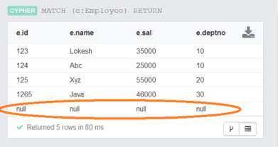

#### 4.14 IN操作符

与SQL一样，Neo4j CQL提供了一个IN运算符，以便为CQL命令提供值的集合。

**IN操作符语法**

​`IN[<Collection-of-values>]`​

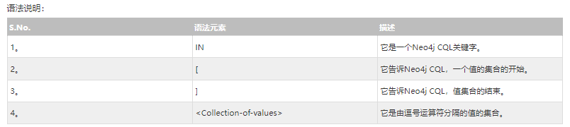

```undefined
MATCH (e:Employee) 
WHERE e.id IN [123,124]
RETURN e.id,e.name,e.sal,e.deptno
```

#### 4.15 图形字体

我们使用Neo4j数据浏览器来执行和查看Neo4j CQL命令或查询的结果。

Neo4j数据浏览器包含两种视图来显示查询结果 -

* UI查看
* 网格视图

我们将讨论如何在**UI视图**中更改节点或关系的字体。

默认情况下，Neo4j数据浏览器**以小字体显示节点或关系图，并在UI视图中显示默认颜色**。 如果我们想要在更大的字体或不同的颜色中查看它们，那么如何增加他们的字体（大小）或如何改变他们的颜色。

‍

### 5.CQL函数操作

#### 5.1 字符串函数

与SQL一样，Neo4J CQL提供了一组String函数，用于在CQL查询中获取所需的结果。

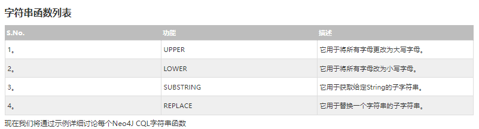

##### **UPPER**

函数语法 `UPPER (<input-string>)`​ ------**注意：**<input-string>可以是来自Neo4J数据库的节点或关系的属性名称。

```undefined
MATCH (e:Employee) 
RETURN e.id,UPPER(e.name),e.sal,e.deptno
```

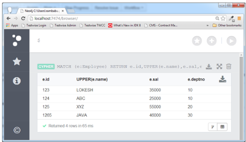

##### LOWER（类似）

##### SUBSTRING（获取子串）

```undefined
MATCH (e:Employee) 
RETURN e.id,SUBSTRING(e.name,0,2),e.sal,e.deptno
```

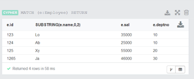

切片前两个字符。

##### REPLACE（替换字符串）

MATCH (e:Employee)  
RETURN e.id,REPLACE(e.name,"XYZ","XXX"),e.sal,e.deptno

#### 5.2 AGGREGATION聚合函数

和SQL一样，Neo4j CQL提供了一些在RETURN子句中使用的聚合函数。 它类似于SQL中的GROUP BY子句。

我们可以使用MATCH命令中的RETURN +聚合函数来处理一组节点并返回一些聚合值。

​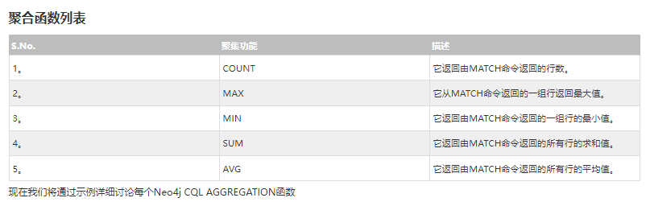​

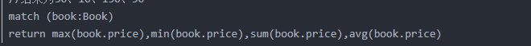

#### 5.3 关系函数

Neo4j CQL提供了一组关系函数，以在获取开始节点，结束节点等细节时知道**关系的细节**。

在这里，我们将讨论一些重要的和经常使用的功能。

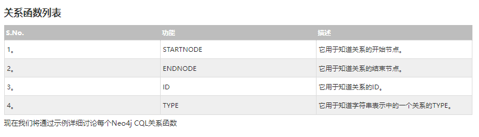

​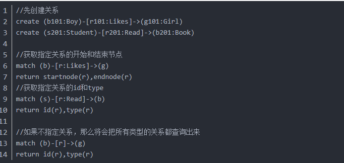​

‍
